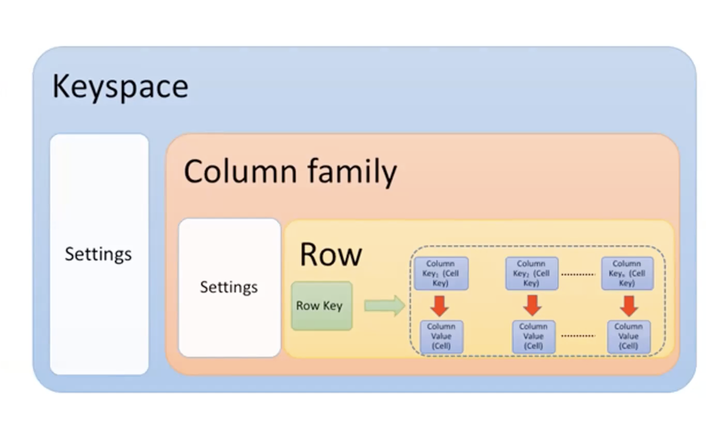
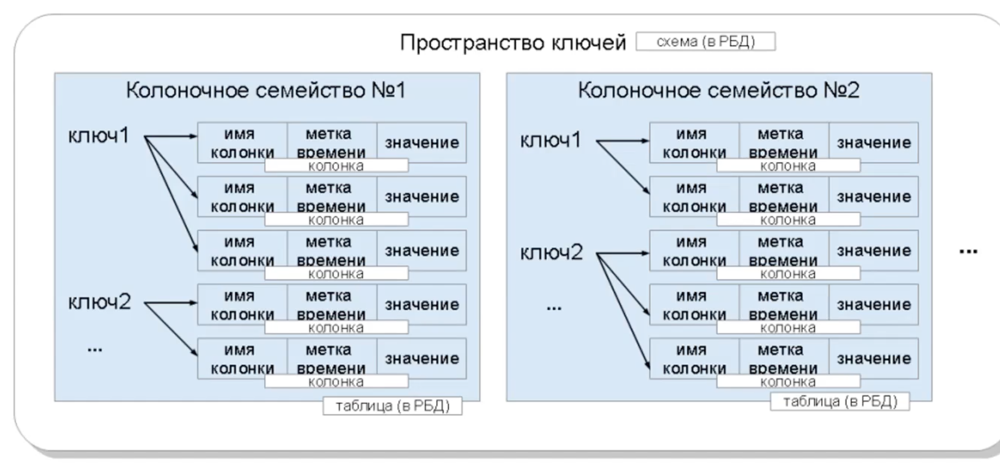
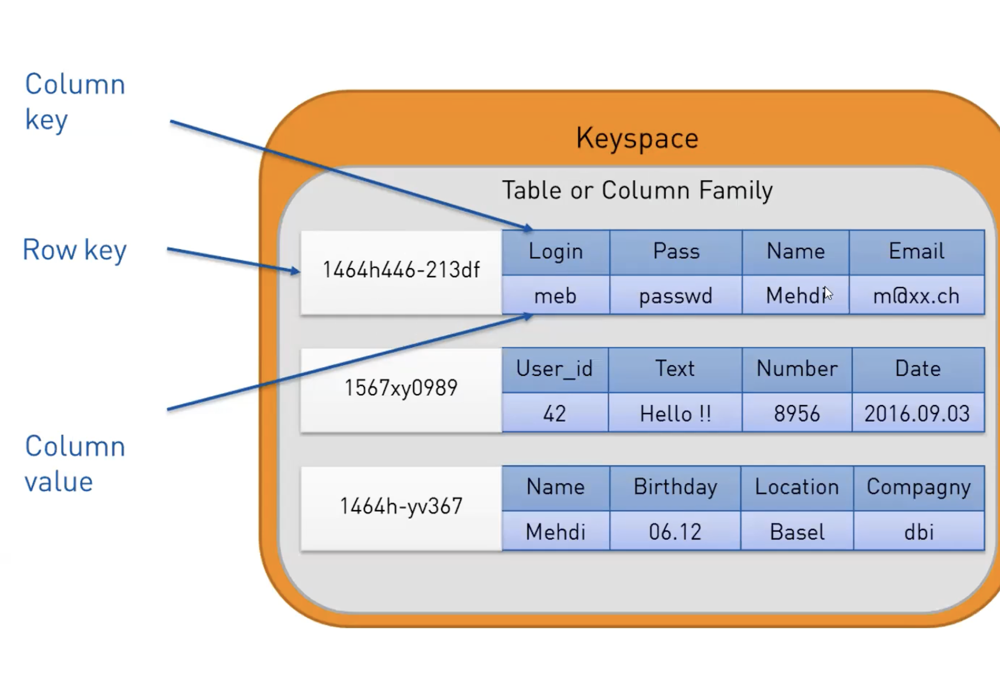
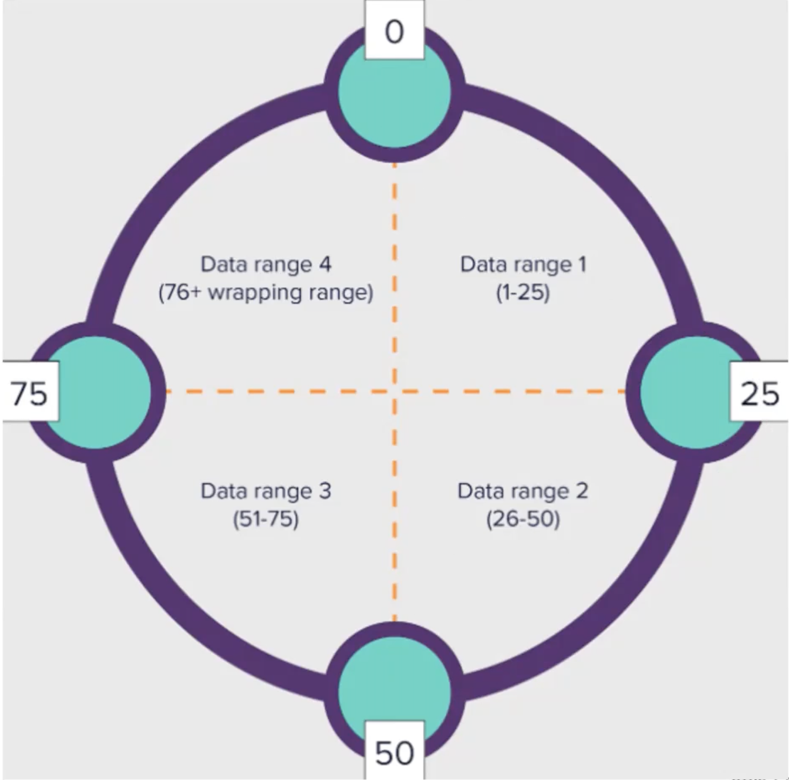
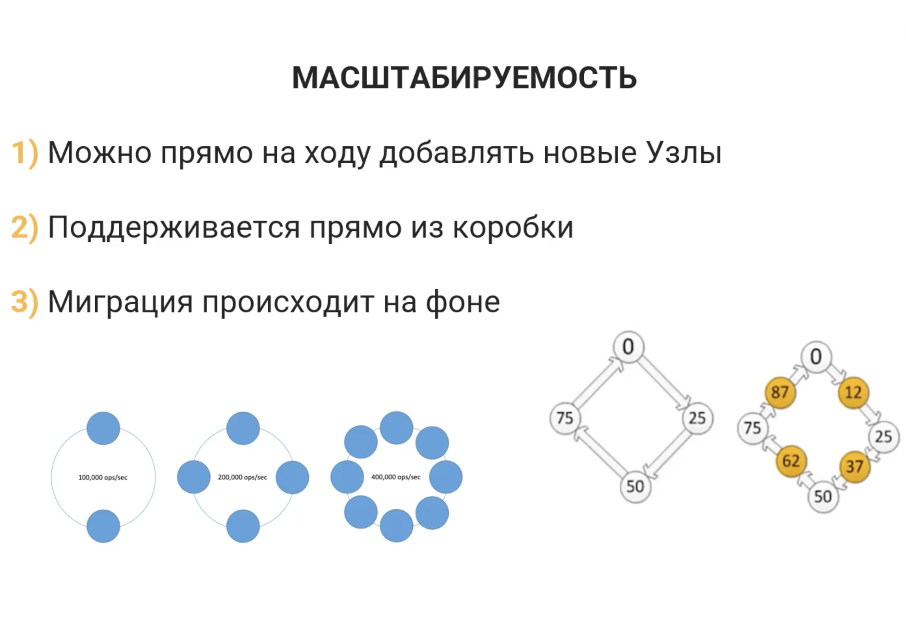
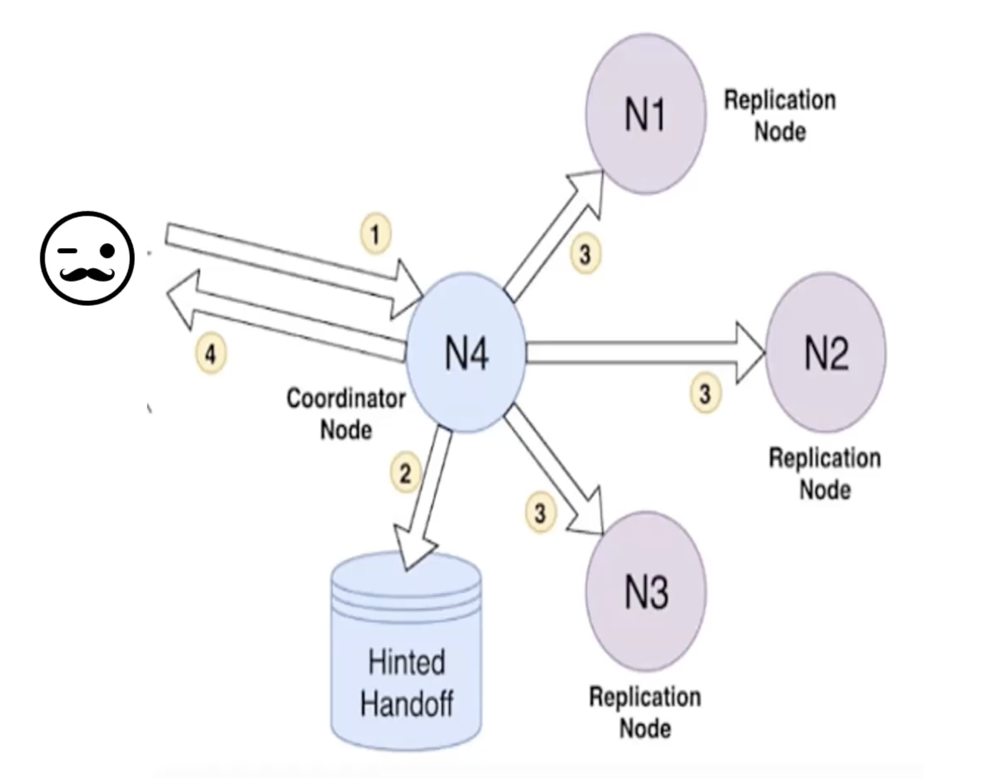
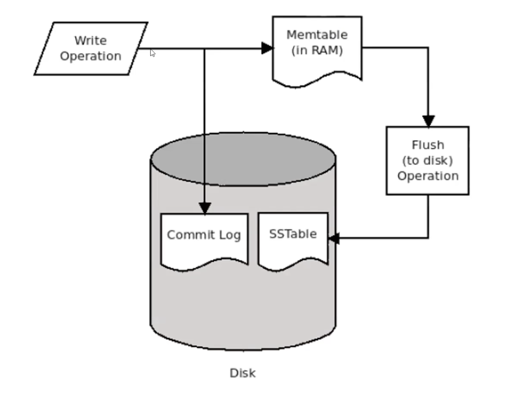
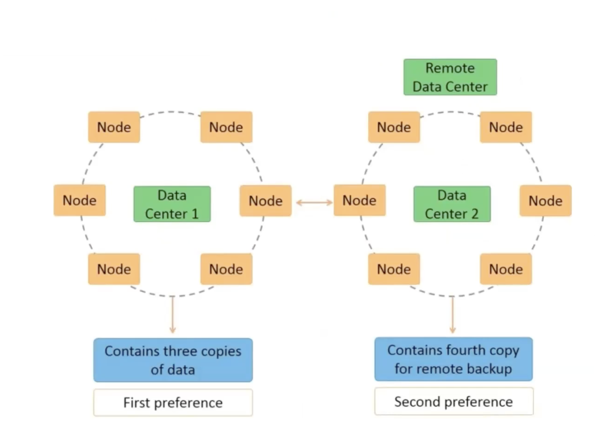
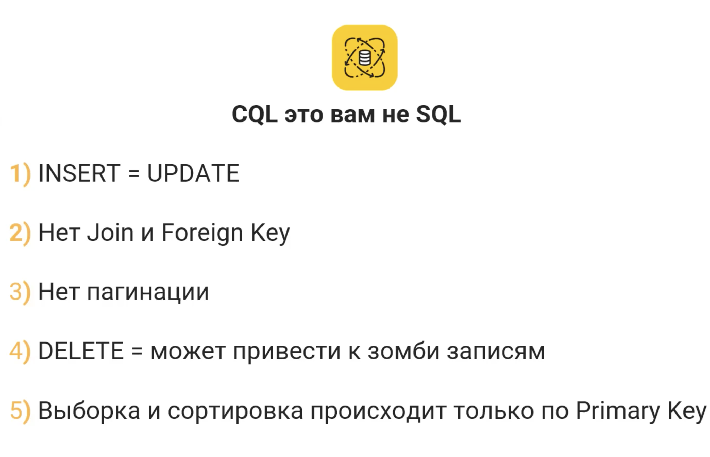
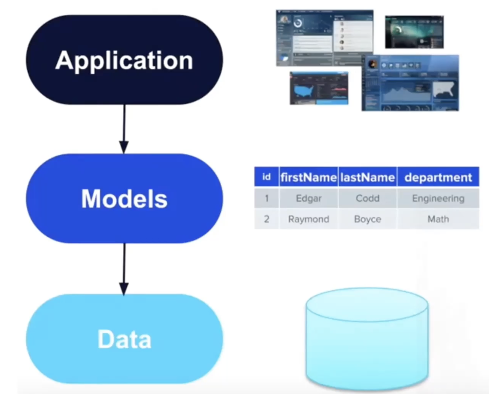

# Cassandra

> Apache Cassandra является распределенной системой управления базами данных, 
> которая обеспечивает высокую доступность без единой точки отказа.

Терминалогия casandra
* Table = Column family
* Keyspace - пространство для таблиц
* ReplicationFactory - отвечает за параметр - сколько копий данных нужно хранить внутри keyspace.
  Этот показатель не может быть больше или равна количеству Node внутри реплики!

### Согласованность (Consistency)
Cassandra обеспечивает слабую согласованность данных, то есть операции на запись
могут завершаться до того, как данные станут доступны для чтения на всех узлах.

### Доступность (Availability)
Cassandra обеспечивает высокую доступность для чтения и записи, но только в режиме `quorum`
и эта доступность может уменьшаться в случае разделения сети.

### Устойчивость к разделению (Partition tolerance)
Cassandra обеспечивает хорошую устойчивость к разделению и может продолжать работать
даже при разделениии сети.

## Cassandra по умолчанию настроена на работу в AP
Это означает, что она обеспечивает высокую доступность и устойчивость к разделению, 
но может привести к снижению согласованности данных.

### Преимущества
* Высокая масштабируемость 
* Отлично выполненная репликация прямо из коробки 
* Высокая скорость записи и чтения
* Каждый клиент может настраивать свой уровень согласованности 
* SQL подобный язык запросов

# Architecture

> Каждый Keyspace настраивается отдельно
> 
> Column family - это таблицы. Каждую таблицу можно настраивать индивидуально
> 
> У каждой таблицы есть Row, где хранятся записи.
> 
> Row key - уникальный ключ записи 
> Каждая Row Key привязана к нескольким колонокам 

* метка времени - означает, когда в последний раз таблица была обновлена

Пример таблица и записей в ней:

 # Token Ring архитектура 
В Cassandra используется алгоритм токенов для распределения данных между узлами.
Каждый узел в кластере отвечает за определенный диапазон токенов.
Когда данные записываются в кластер, Cassandra вычисляет токен для записи и определяет,
какой узел будет отвечать за хранение этого токена.

На картинке представлено 4 узла, каждый из которых отвечает за свой диапазон токенов.
При чем в casandra все ноды равноправны, и нет никакого центрального узла, который бы
отвечал за распределение данных.

# Масштабируемость 
Cassandra обеспечивает высокую масштабируемость, как вертикальную, так и горизонтальную.
* Вертикальная масштабируемость - это возможность увеличивать производительность системы
* Горизонтальная масштабируемость - это возможность увеличивать объем данных в системе

На рисунке представлен прирост в количестве операций в секунду при увеличении 
количества Node в кластере (с 2 до 8).
* При чем casandra в фоновом режиме добавляет новые Node в кластер, 
и не требует перезапуска системы для этого.
* Каждая Node знает о всех остальных Node в кластере, и может обращаться к ним напрямую.
* При добавлении новых Node в кластер, Cassandra перераспределяет Token Ring, между узлами.

# Consistency level (уровень согласованности)
* One - означает, что операция на запись будет считаться успешной,
если она будет выполнена хотя бы на одном узле.
* Two - означает, что операция на запись будет считаться успешной,
если она будет выполнена хотя бы на двух узлах.
* Quorum - означает, что операция на запись будет считаться успешной,
если она будет выполнена хотя бы на большинстве узлов.
* All - означает, что операция на запись будет считаться успешной,
если она будет выполнена на всех узлах.
* Any - означает, что операция на запись будет считаться успешной,
если она будет выполнена хотя бы на одном узле или Hinted Handoff.

# Hinted Handoff
* Hinted Handoff - это механизм, который позволяет сохранять данные на узле,
если один из узлов временно недоступен.
* Когда узел становится доступным, Cassandra автоматически передает ему данные,
* которые были сохранены во время его недоступности.
* Hinted Handoff позволяет обеспечить высокую доступность данных,
* даже если один из узлов временно недоступен.

# Read and Write
При записи или чтении данных, запрос может попасть на любую из Node в кластере. 
При этом, если Node не отвечает, то запрос будет перенаправлен на другой Node.
Когда Node получает запрос, он попытается сохранить или прочитать данные на своем узле, 
и в зависимости от настроек уровня согласованности, он может отправить запрос на другие Node.
Если на Node прилетел запрос на запись и он не может выполнить его, так же какой-то из Node 
не отвечает, то он сохранит данные в Hinted Handoff, и когда узел станет доступным,
он передаст ему данные. Чтобы при падении Node не получить ошибку на запись, нужно выставить 
WC на уровень ANY, тогда Hinted Handoff будет включена. Но все равно рекомендуется выбрать
STRONG CONSISTENCY. 

## Write
* При записи на Node данные сначала попадает на Commit Log, а затем в MemTable.
* Commit Log - это журнал, который хранит все операции на запись.
* MemTable - это кэш, который хранит все операции на запись.
* Когда MemTable заполняется, он переносится в SSTable.
* SSTable - это файл, который хранит все операции на запись.

# STRONG CONSISTENCY 
> WC + RC -> RF
> 
> WC - Write Consistency
> RC - Read Consistency
> RF - Replication Factor

Чтобы обеспечить сильную согласованность данных, необходимо настроить WC и RC. 
Есть 2 режима настройки: 
1) WC = ALL, RC = ONE
   * Запись будет выполняться медленно, так как она должна быть выполнена на всех узлах.
   * Чтение будет выполняться быстро
   * При отказе 1 из NODE - запись не будет выполнена 
2) WC = ONE, RC = ALL
   * Запись будет выполняться быстро
   * Чтение будет выполняться медленно, так как оно должно быть выполнено на всех узлах.

# Подключение к casandra 
> подключение к casandra происходит через 2 стратегии: 
> 1) SimpleStrategy - используется для одного дата-центра
>    Всего лишь 1 кластер, что крайне не рекомендуется
> 2) NetworkTopologyStrategy - используется для нескольких дата-центров
> 
> При подключении к casandra, нужно указать какой стратегии будет использоваться
> и какие параметры будут переданы в эту стратегию.
>
Network Topology Strategy

# В casandra используется CQL (Cassandra Query Language) 
* CQL - это язык запросов, который используется для создания и управления данными в Cassandra.

* зомби записи - это записи, которые были удалены на некоторых NODE, но еще не удалены на всех NODE.

# Когда нужно использовать casandra
1) Глобальная распределенность данных (несколько дата-центров: Европа, Азия, Америка)
2) Линейная масштабируемость (при добавлении новых NODE, производительность увеличивается)
3) Количество записей превышает чтение (чтение медленнее записи)
4) Минимум update (потому-что update = insert)
5) Четкое понятие стректуры проекта (таблицы, записи, запросы)
6) Минимум использование delete (проблема с зомби записями, когда какая-то NODE не успела удалить запись)

# Data Types
Casandra поддерживает следующие типы данных:
* Примитивные типы (int, float, double, boolean, text, varchar, blob, timestamp, uuid)
* Списки (list):
  * List - список значений
  * Map - hash table
  * Set - тоже самое, что и List только без дубликатов
* User-Defined Data Type (UDT) - пользовательские типы данных
> При планировании структуры таблицы, нужно заранее знать запросы которые будут выполняться
> и какие данные будут храниться в таблице.
> Потому-что в cassandra нет нормализации данных, и если вам нужно будет добавить новые данные
> в таблицу, то вам придется создавать новую таблицу.
> Построение структуры таблицы в cassandra начинается от слоя самого приложения (в отличии от SQL, 
> где приложение строится вокрук данных из DB).

# Primary Key (первичный ключ)
* Primary Key состоит из Partition Key и Clustering Key.
  * Partition Key - отвечает за распределение данных между узлами и является обязательным, так как 
  отвечает за уникальность данных внутри узла. Может быть простым или составным 
  (состоящим из нескольких колонок).
  * Clustering Key - отвечает за сортировку данных внутри узла, является опциональным.
    * Позволяет писать запросы не только по Partition Key, но и по Clustering Key.
    * При сортировке выборка выполняется быстрее
    * Данные хранятся в четком порядке

