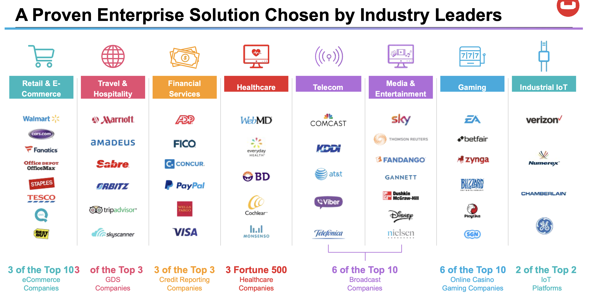
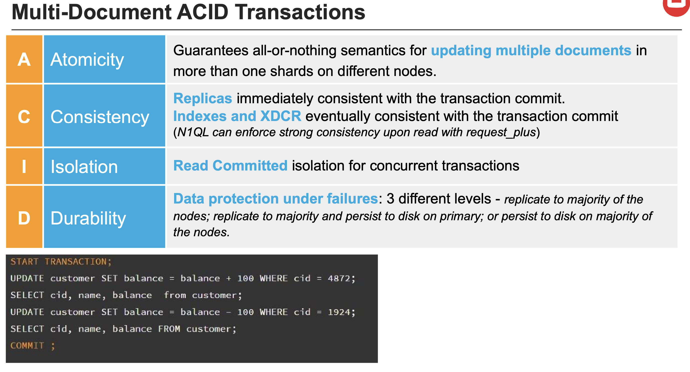
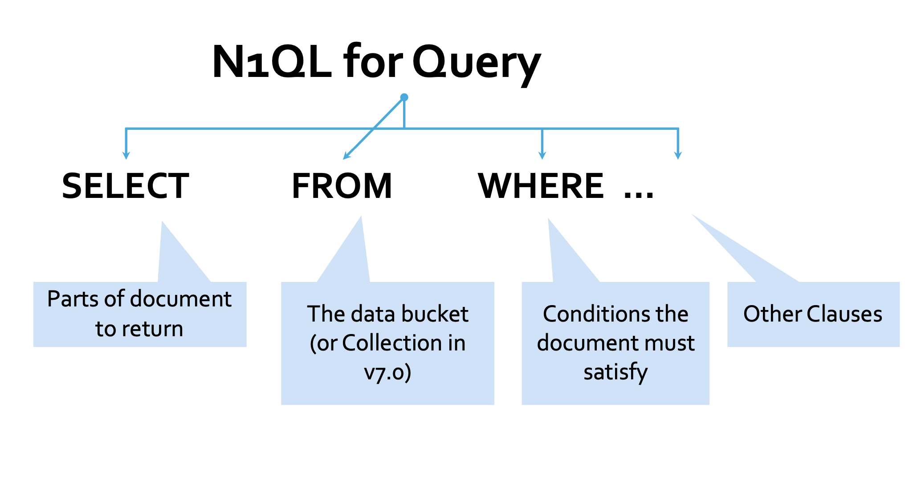
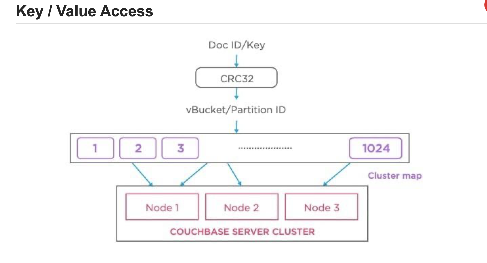
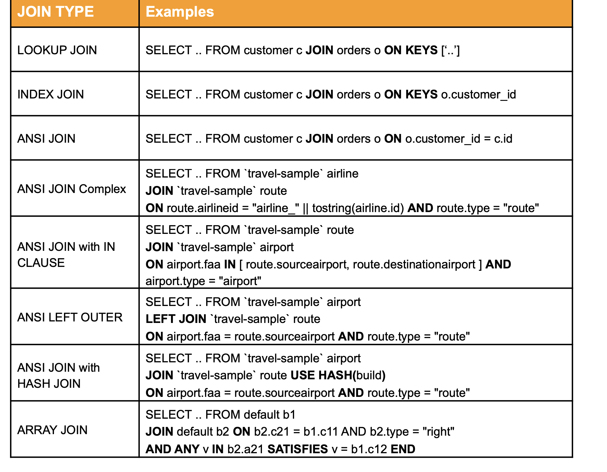
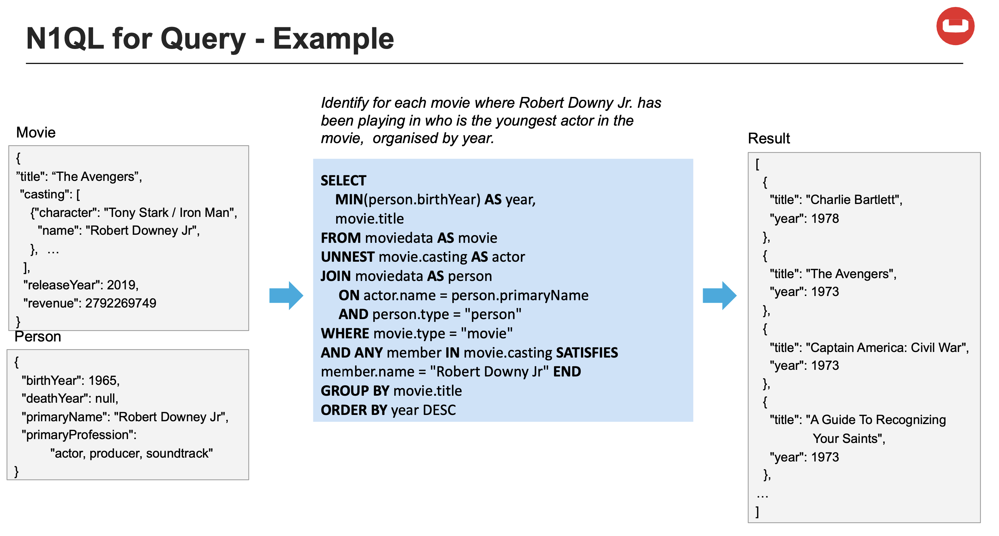
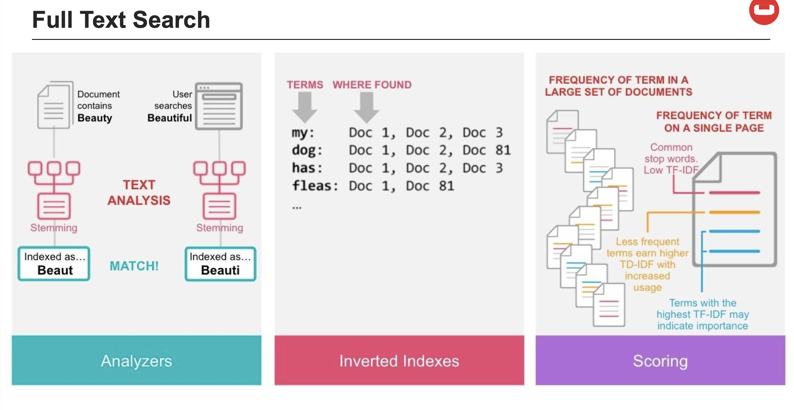
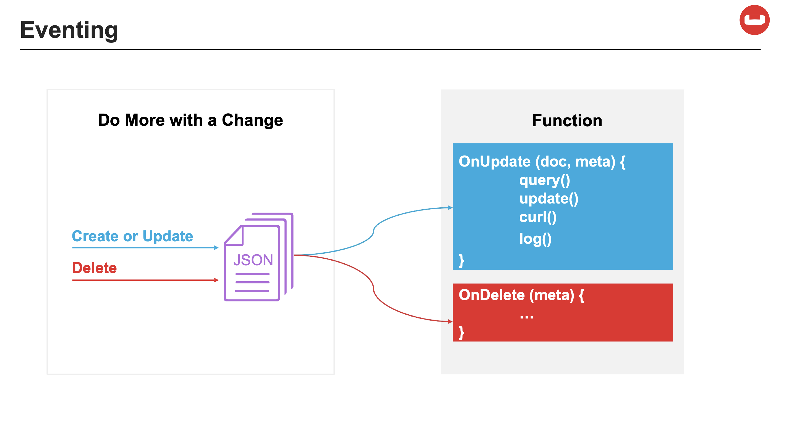
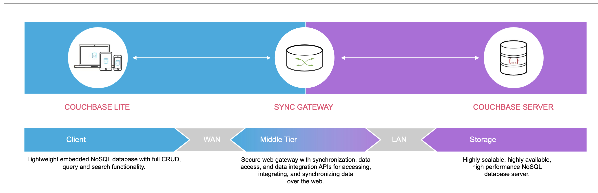

# Couchbase

> Couchbase - это NoSQL база данных, которая хранит данные в виде пар ключ-значение. 
> Она предназначена для хранения больших объемов данных, 
> которые могут быть распределены по нескольким серверам в кластере.
> Каждый сервер в кластере называется узлом. 
> Кластер может содержать несколько узлов.
> Кластеры могут быть горизонтально масштабируемыми, 
> что означает, что вы можете добавлять новые узлы в кластер,
> чтобы увеличить его пропускную способность и хранить больше данных.
> 

> Couchbase — это слияние двух популярных технологий NOSQL:
> * Membase, обеспечивающая постоянство, репликацию и передачу по высокопроизводительной технологии memcached
> * CouchDB, которая является пионером в документно-ориентированной модели на основе JSON

Couchbase Server поддерживает ACID Transactions

Couchbase Server поддерживает SQL язык запросов, но важно понимать, что это не реляционная база данных.
И SQL язык запросов используется только для упрощения работы с данными!
А на самом деле данные хранятся в виде документов в формате JSON.
И язык запросов называется N1QL (произносится как Nickel).

Все данные в Couchbase хранятся в bucket-ах.
Bucket - это контейнер для документов.
Каждый документ имеет уникальный ключ, который должен быть уникальным в пределах bucket-а.

Couchbase поддерживает все возможные виды SQL запросов: 
* SELECT
* INSERT
* UPDATE
* DELETE
* UPSERT
* MERGE

Couchbase поддерживает все возможные виды JOIN-ов:

Однако лучше не злоупотреблять JOIN-ами, так как они могут сильно снизить производительность.
Потому-что couchbase - это NoSQL база данных, а не реляционная.
И при планировании структуры данных нужно учитывать, что JOIN-ы будут использоваться редко, 
а так-же стараться придерживаться денормализации данных,
а не нормализации как при проектировании реляционных баз данных.

Пример запроса в couchbase:

Couchbase так-же поддерживает полнотекстовый поиск по документам.
Для этого используется специальный сервис - Full Text Search (FTS).
Однако он будет уступать по скорости и функционалу специализированным решениям,
таким как ElasticSearch или Solr.

Одна из очень полезных возможностей couchbase - это Eventing. 
Можно привязать функцию на события, которые происходят в базе данных.

Couchbase прекрасно подходит для мобильных приложений, 
так как имеет встроенную поддержку синхронизации данных между мобильными устройствами и сервером.
Это реализовано с помощью сервиса - Couchbase Mobile.
На мобильном устройстве устанавливается Couchbase Lite,
который является легковесной версией Couchbase Server.
И он может работать в offline режиме, а так-же синхронизировать данные с сервером.

Couchbase может интегрироваться почти со всеми популярными решениями и технологиями.
Так-же есть множество драйверов для популярных языков программирования.
