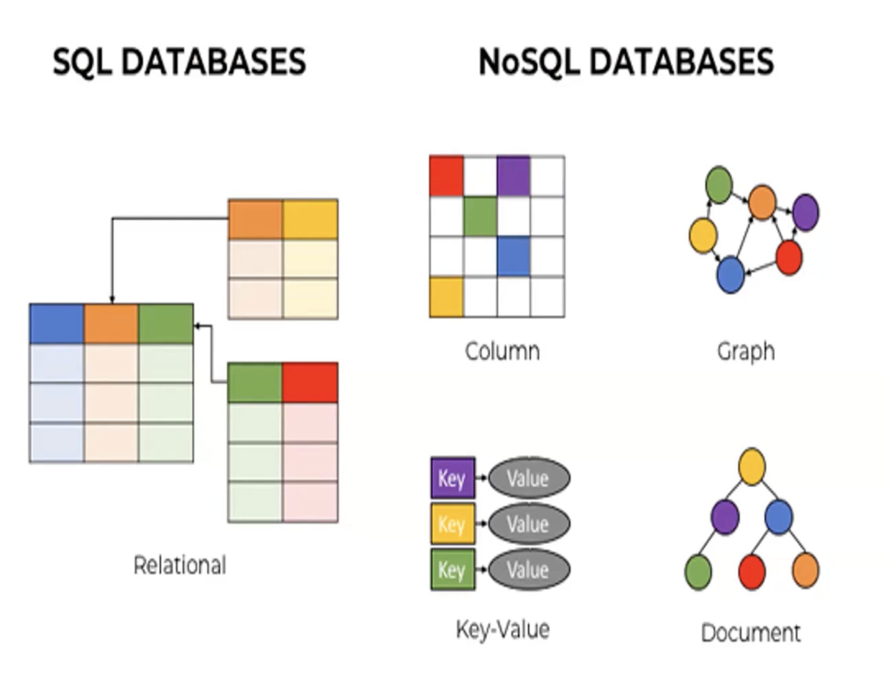

# Курс по noSQL базам данных

## Теория
> SQL БД являются реляционными, в то время как noSQL БД являются нереляционными.
> 
> SQL языки используют вертикальное расширение, а NoSQL используют горизонтальное расширение. 
> 
> SQL отталкивается от четкой и статичной структуры вашей БД, а NoSQL может меняться динамически 
> в зависимости от ваших нужд.
> 
> В NoSQL применяется денормалицация, а в SQL нормализация.
> Денормалицазия - это процесс добавления избыточности в данные,
> когда все хранится в 1 таблице (с повторяющимися данными)
> Нормализация - это процесс разделения данных на несколько таблиц,
> чтобы избежать избыточности данных и обеспечить ссылочную целостность. (связи между таблицами)

> Репликая - создание и поддержание одинаковых копий данных на разных узлах. 
> Это делается с целью обеспечения отказоустойчивости и повышения доступности данных, 
> и повышения производительности.
> Основные свойства репликации:
> * Отказоустойчивость (если один из узлов выходит из строя, то данные остаются доступными)
> * Высокая доступность - копии данных (реплики) могут быть размещены ближе к клиентам,
> что позволяет уменьшить время отклика и увеличить доступность данных.
> * Балансировка нагрузки - реплики могут быть размещены на разных узлах, что позволяет 
> распределять нагрузку между узлами и увеличивать производительность.
> * Чтение и запись - реплики могут быть настроены для чтения и записи, что позволяет
> распределять нагрузку между узлами и увеличивать производительность.
> * Безопасность данных - реплики могут быть размещены в разных дата-центрах, что позволяет
> обеспечить резервное копирование данных и защиту от потери данных в случае катастрофы. Так-же
> это позволяет соблюдать законодательство о хранении данных в разных странах.

> Шардирование - это процесс разделения данных на несколько частей (шардов) и распределения
> этих шардов по разным узлам.

> Cluster - это группа взаимосвязанных серверов которые работают вместе как единая система для
  обеспечения высокой производительности, отказоустойчивости и масштабируемости.
> Основные свойства кластера: 
> * Распределение нагрузки (задачи и данные распределяются между узлами кластера
> для обеспечения параллельной обработки и распределенного хранения)
> * Отказоустойчивость (кластер может продолжать работать, если один или несколько узлов выходят из строя)
> * Масштабируемость (кластер может быть легко расширен путем добавления новых узлов)
> * Высокая производительность (кластер может обрабатывать большое количество запросов в секунду)

> Node - обозначение узла в кластере casandra. Кластер состоит из нескольких Node,
  которые работают вместе для обеспечения отказоустойчивости и распределенной обработки данных.
  Каждый узел в кластере хранит часть данных и может принимать запросы от клиентов.
  Узлы в кластере взаимодействуют друг с другом, чтобы обеспечить целостность данных
  и высокую доступность

> Согласованность - это свойство, которое гарантирует, что все узлы в кластере
> видят одни и те же данные в одно и то же время.

##  Отдельные темы 

* [cap](./theory/cap.md)
## Реляционные базы данных
* [mssql](sql/mssql/mssql.md)

## noSQL базы данных
* [mongoDB](noSQL/mongo-db/mongo-db.md)
* [cassandra](noSQL/cassandra/cassandra.md)
